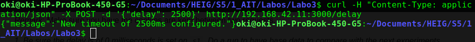

# AIT - Laboratoire 3 - Load Balancing

**Authors: Olivier Koffi, Nathanaël Mizutani**

### Introduction

In this lab, we will use HAProxy in different cases.<br/>
At first, we will test the proxy with its default configuration, that means round-robin mode without sticky-sessions<br/>
Then, we will configure the proxy to manage sticky-sessions.<br/>After that, we will experiment the `DRAIN` and `MAINT` modes.<br/>
Finally, we will configure and compare different balancing modes.<br/>

### Task 1: Install the tools

*1. Explain how the load balancer behaves when you open and refresh the URL <http://192.168.42.42> in your browser. Add screenshots to complement your explanations. We expect that you take a deeper a look at session management.*

**Answer**

When we refresh the browser on the URL http://192.168.42.42 we can see that the request is sent alternatively on each web server. HAProxy seems to work with a round robin configuration by default.

We also can see that the `NODESESSID` is refreshed for each request. This is because each server receives the token from the other one and doesn't recognize it. So it sets a new cookie containing a new `NODESESSID`. The same thing happens on the second server.

In fact, we have a setup that demands sticky sessions but HAProxy is configured in a stateless mode by default.

You can see below the results of two successive requests:


*2. Explain what should be the correct behavior of the load balancer for session management.*

**Answer**

HAProxy should be configured to be statefull. That means it should forward existing sessions on the correct server. This is what we call sticky sessions.

*3. Provide a sequence diagram to explain what is happening when one requests the URL for the first time and then refreshes the page. We want to see what is happening with the cookie. We want to see the sequence of messages exchanged (1) between the browser and HAProxy and (2) between HAProxy and the nodes S1 and S2.*

**Answer**


*4. Provide a screenshot of the summary report from JMeter.*

**Answer**


*5. Run the following command:*

  ```bash
  $ docker stop s1
  ```

*Clear the results in JMeter and re-run the test plan. Explain what is happening when only one node remains active. Provide another sequence diagram using the same model as the previous one.*

**Answer**


Now HAProxy forwards all traffic on S2 because it's the only server up.
S2 now recognizes the cookie `NODESESSID`, because it's the one it has set. So there is no need for a new cookie.
The session is established, so the `sessionViews` is incremented at each new request. But it's not due to the fact that HAProxy is configured to manage sticky sessions, it's rather because S2 is the only server up, so all the traffic is always forwarded there.


### Task 2: Sticky sessions

*1. There is different way to implement the sticky session. One possibility is to use the SERVERID provided by HAProxy. Another way is to use the NODESESSID provided by the application. Briefly explain the difference between both approaches (provide a sequence diagram with cookies to show the difference).*

**Answer**

With `SERVERID`, HAProxy is configured to add a cookie (named `SERVERID`) in the server response to identify the server. When the client send another request, the proxy reads the `SERVERID` cookie and forwards the request to the correct server. HAProxy inserts a `SERVERID` cookie in the server's response only if it doesn't exist in the client's request, if it already exists it just forwards requests and responses.

With `NODESESSID`, it's almost the same operation. The application on the server sets a `NODESESSID` and then the proxy concatenate the server id in the cookie. When the client sends another request, the proxy  extracts the cookie from the request and reads it in order to redirect the request to the correct server.

*Choose one of the both stickiness approach for the next tasks.*

We'll use the `SERVERID` mechanism for the following manipulations.

*2. Provide the modified `haproxy.cfg` file with a short explanation of the modifications you did to enable sticky session management.*

**Answer**


The line starting with `cookie` indicates to HAProxy that it must insert a `Set-Cookie` named `SERVERID` into the response's header when a client sends a request for the first time (or rather if the client has not a `SERVERID` cookie already set).

We also added `cookie s1` for server s1 and `cookie s2` for server s2 to set the content of the `SERVERID` cookie that will be stored in the client's browser.

*3. Explain what is the behavior when you open and refresh the URL <http://192.168.42.42> in your browser. Add screenshots to complement your explanations. We expect that you take a deeper a look at session management.*

**Answer**


Now, when the page is refreshed several times, the `NODESESSID` is still the same and `sessionViews` is incremented. That shows that HAProxy is now configured to manage sticky sessions.

In the above image, we can see that the `SERVERID` cookie is set to s1. That's because HAProxy set it up in the first response and now as long as the client's browser keeps the `SERVERID` cookie, HAProxy will receive it in each request and forwards messages to s1.

*4. Provide a sequence diagram to explain what is happening when one requests the URL for the first time and then refreshes the page. We want to see what is happening with the cookie. We want to see the sequence of messages exchanged (1) between the browser and HAProxy and (2) between HAProxy and the nodes S1 and S2. We also want to see what is happening when a second browser is used.*

**Answer**


*5+6. Provide a screenshot of JMeter's summary report. Is there a difference with this run and the run of Task 1? Give a short explanation of what the load balancer is doing.*

  * *Clear the results in JMeter.*

  * *Now, update the JMeter script. Go in the HTTP Cookie Manager and
    <del>uncheck</del><ins>verify that</ins> the box `Clear cookies each iteration?`
    <ins>is unchecked</ins>.*

  * *Go in `Thread Group` and update the `Number of threads`. Set the value to 2.*


**Answer**

This question could be tricky because it looks like there are no differences between the test above and the test from the task 1 but in fact, there is more than meets the eye.

In the task 1, there is only one thread (user) sending 1000 requests and HAProxy simply dispatches each request in round robin mode. That means each successive request goes respectively on s1, then s2. But there is no sticky sessions. A new `Set-Cookie: NODESESSID` is added in  the header of the response of each request !

In this test, there are now 2 threads (users) sending 1000 requests each but this time sticky sessions is configured. That means user1 sent 1000 requests on s1 and user2 sent 1000 requests on s2.

s1 and s2 added a `Set-Cookie` in the header of the response only at the first request from user1 and user2 respectively. The `sessionViews` has been incremented to 1000 for each user.

### Task 3: Drain mode

*1+2. Take a screenshot of the Step 5 and tell us which node is answering.*

**Answer**


The page has been refreshed 30 times. We can see that it is the node s2 who is answering.

*2. Based on your previous answer, set the node in DRAIN mode. Take a screenshot of the HAProxy state page.*

**Answer**


We can see that the s2 node line changed to blue (active or backup SOFT STOPPED for maintenance)

*3. Refresh your browser and explain what is happening. Tell us if you stay on the same node or not. If yes, why? If no, why?*

**Answer**


When we refresh the browser, we stay on the same node.
It is as expected because as explained during the course, `DRAIN mode` lets current sessions continue to make requests to the node that is in `DRAIN mode` and will redirect all other traffic to the other nodes.

*4. Open another browser and open `http://192.168.42.42`. What is happening?*

**Answer**


As expected, all other traffic is redirected to the other node s1.

*5. Clear the cookies on the new browser and repeat these two steps multiple times. What is happening? Are you reaching the node in DRAIN mode?*

**Answer**


The node in `DRAIN mode` (s2) is never reached because only the sessions that already existed when it was set to `DRAIN mode` are redirected to it. Again, all other traffic will be redirected on s1.

*6. Reset the node in READY mode. Repeat the three previous steps and explain what is happening. Provide a screenshot of HAProxy's stats page.*

**Answer**


Now, we can see that s2 is reached one time in two with the new browser when the cache is cleaned between each request. This is the normal round robin mode.

*7. Finally, set the node in MAINT mode. Redo the three same steps and explain what is happening. Provide a screenshot of HAProxy's stats page.*

**Answer**


This time, we can see that both browsers (firefox with current session and chrome without session) have switch to s1. The s2 node line in the HAProxy's state page changed to brown (active or backup `DOWN` for maintenance (`MAINT`)).

As expected, in `MAINT mode`, the node can't be reach by any request, even those with sessions already established. All traffic is redirect on the only node `UP`, s1.

### Task 4: Round Robin in degraded mode

*Remark*: In general, take a screenshot of the summary report in JMeter to explain what is happening.</br>
*Remark*: Make sure you have the cookies are kept between two requests.

*1. Be sure the delay is of 0 milliseconds is set on `s1`. Do a run to have base data to compare with the next experiments.*

**Answer**


*2. Set a delay of 250 milliseconds on `s1`. Relaunch a run with the JMeter script and explain what it is happening?*

**Answer**


Now we can see the average response time for a request on s1 is 292 [ms]. It is because we configured s1 to put a delay of 250 [ms] before sending a response.

*3. Set a delay of 2500 milliseconds on `s1`. Same than previous step.*

**Answer**




Now we can see that s1 is never reached. All traffic goes on s2.

*4. In the two previous steps, are there any error? Why?*

**Answer**


With 250 [ms] delay, s1 is slow but there is no errors for HAProxy. When we configure s1 with a 2500 [ms] delay, HAProxy considers s1 as down. This is the reason why all traffic is redirected to the other nodes.

*5. Update the HAProxy configuration to add a weight to your nodes. For that, add `weight [1-256]` where the value of weight is between the two values (inclusive). Set `s1` to 2 and `s2` to 1. Redo a run with 250ms delay.*

**Answer**


/!\ We need to rebuild images to actualize configuration.

*6. Now, what happened when the cookies are cleared between each requests and the delay is set to 250ms ? We expect just one or two sentence to summarize your observations of the behavior with/without cookies.*

**Answer**

With cookie :


- We can see that there is no differences in terms of response time because HAProxy is configured to manage sticky sessions so all traffic is send to s1; because there is a session between the client and s1.

Without cookie :


- Now HAProxy behaves like a "normal" load balancer because there is a new session at each request.<br/>
S1 weights 2 and S2 weights 1, that means on three requests two will be sent to S1 and one to S2.<br/>
So the average response time is a bit better because S2 has "0" [ms] delay.<br/>
But a better configuration would be to set a heavier weight to S2 because it has a better response time than S1. It would also improve the average response time.

### Task 5: Balancing strategies

**1. Briefly explain the strategies you have chosen and why you have chosen them.**

**Answer**
* `static-rr`:<br/> Each server is used in turns, according to their weights.<br/> This algorithm is similar to round robin except that it is static, which means that changing a server weight on the fly will have no effect. It also uses slightly less CPU to run (around -1%). We chose this one to compare performances with an algorithm that has better performances with long sessions.

* `leastconn`:<br/> This system configures HAProxy to choose the server with the lowest number of active connections. If several servers have the same load, then Round-robin between them is applyed.<br/> This algorithm is recommended when very long sessions are expected.<br/> We chose this one to compare the performances with an algorithm that has better performances with short sessions.


**2. Provide evidences that you have played with the two strategies (configuration done, screenshots, ...)**

**Answer**

**static-rr:**

Configuration


Without sticky-session


With sticky-sesison


**leastconn:**

Configuration


Without sticky-session


With sticky-sesison


**3. Compare the both strategies and conclude which is the best for this lab (not necessary the best at all).**

**Answer**

For the tests, we put the total number of requests at 100'000 to better see performances.<br/> As we expected, the `static-rr` mode has a better response time average. This is because the round-robin algorithm is really easy and HAProxy doesn't need to do any complex operation before forwarding the request and the response. Moreover because we have only short session time for our application, `rr-static` is a better solution than `leastconn`.

### Conclusion

This lab allowed us to get familiar with the HAProxy environment and its features. We also found out some other balancing modes (e.g. first, source, uri) that can be used for specific infrastructure types or requirements. <br/>HAProxy configuration file is easy to administrate and the community edition is free. This tool could be used as reverse proxy for a small or medium infrastructure.
